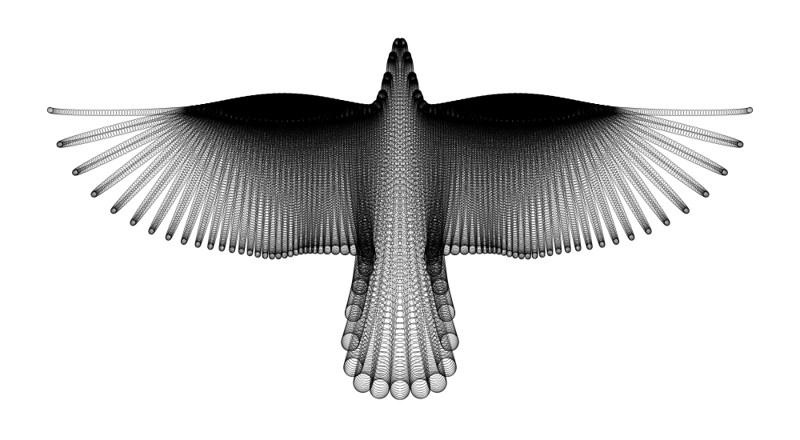

---
myst:
  html_meta:
    "canonical": "https://writing-technically.readthedocs.io/en/latest/courses-dita-authoring-infotype.html"
    "description": "A lesson that explains information typing in DITA and contains some exercises"
    "title": "Learn about information typing in DITA"
    "twitter:description": "A lesson that explains information typing in DITA and contains some exercises"
    "twitter:title": "Learn about information typing in DITA"
    "twitter:image": "https://writing-technically.readthedocs.io/en/latest/_static/wordcloud.jpg"
    "twitter:card": "summary_large_image"
    "twitter:creator": "@anindita_basu"
    "twitter:site": "@anindita_basu"
    "og:locale": "en_US"
    "og:site_name": "Writing technically"
    "og:url": "https://writing-technically.readthedocs.io/en/latest/courses-dita-authoring-infotype.html"
    "og:type": "article"
    "og:title": "Learn about information typing in DITA"
    "og:description": "A lesson that explains information typing in DITA and contains some exercises"
    "og:image": "https://writing-technically.readthedocs.io/en/latest/_static/wordcloud.jpg"
    "author": "Anindita Basu"
---

# Information typing

31 March 2024

DITA architecture has something called topic types, which you can think of as blocks that are built in a specific way and based on a standard model. For example, the following image shows the repeated use of a specific block or model to create an object.

Topic types in DITA are modelled on the kind of information that the topic is serving to its readers, and are structured in a manner that makes it easy for the writer to present that information. 

Topic types answer one - and only one - type of question. DITA has several topic types; this course focusses on the following three topic types:

-  Concept 
    -  What is this about
    -  Why does it behave the way it does
    -  When do I need it
-  Task
    -  How do I do this
-  Reference
    -  Where do I look this up

    

##  Exercise

## Course contents

-  [Learn to write in (and with) DITA](courses-dita-authoring.md)
    -  [Information typing](courses-dita-authoring-infotype.md)
    -  Tags
    -  Maps
    -  Reuse
    -  Single sourcing
   

