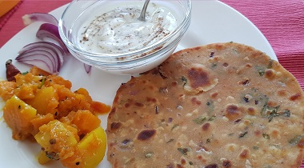
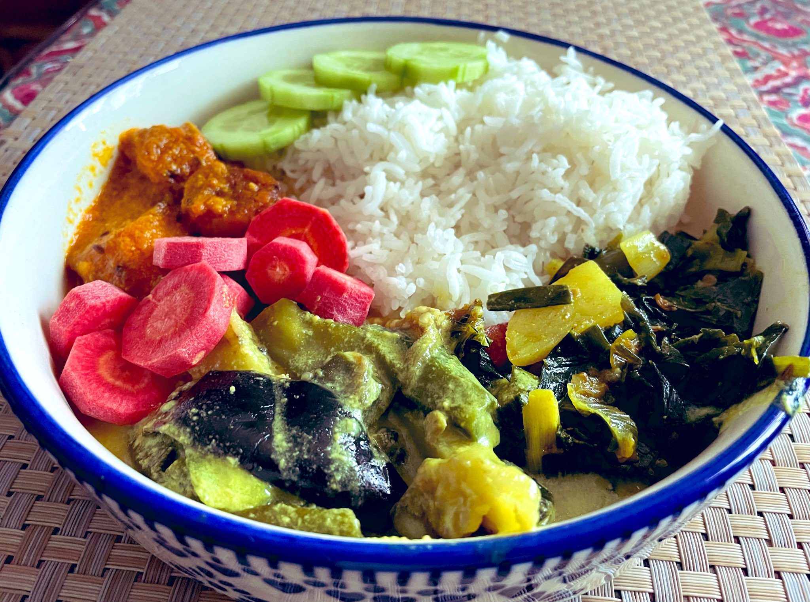
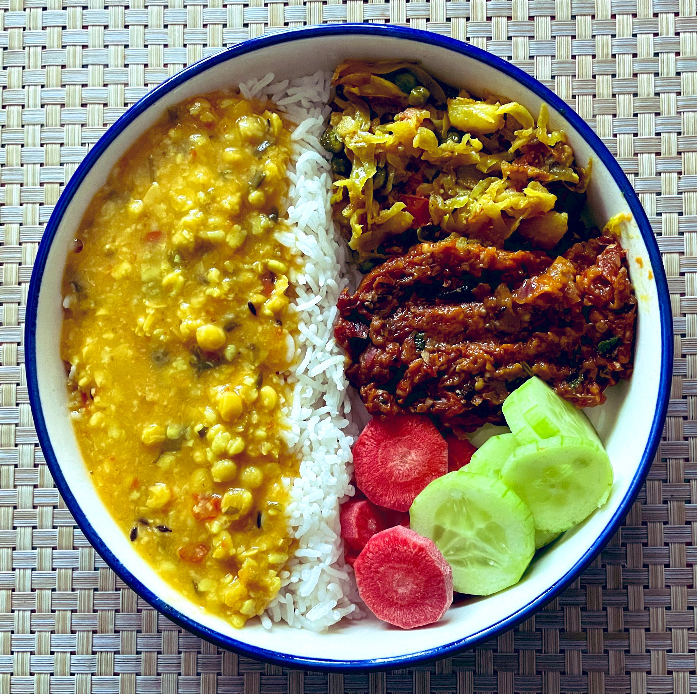

---
myst:
  html_meta:
    "canonical": "https://writing-technically.readthedocs.io/en/latest/courses-dita-authoring-maps.html"
    "description": "A lesson that explains DITA maps and contains some exercises"
    "title": "Learn about maps in DITA"
    "twitter:description": "A lesson that explains DITA maps and contains some exercises"
    "twitter:title": "Learn about maps in DITA"
    "twitter:image": "https://writing-technically.readthedocs.io/en/latest/_static/wordcloud.jpg"
    "twitter:card": "summary_large_image"
    "twitter:creator": "@anindita_basu"
    "twitter:site": "@anindita_basu"
    "og:locale": "en_US"
    "og:site_name": "Writing technically"
    "og:url": "https://writing-technically.readthedocs.io/en/latest/courses-dita-authoring-maps.html"
    "og:type": "article"
    "og:title": "Learn about maps in DITA"
    "og:description": "A lesson that explains DITA maps and contains some exercises"
    "og:image": "https://writing-technically.readthedocs.io/en/latest/_static/wordcloud.jpg"
    "author": "Anindita Basu"
---

# DITA lesson 5: Maps

<hr/>
<p style="font-weight:bold;font-size:75%;color:orange">27 April 2024</p>

In a [previous lesson](courses-dita-authoring-topics.md), you created some DITA topics. If you followed through the explanations in [another previous lesson](courses-dita-authoring-infotype.md), your topics are all standalone entities that can be read and understood independently of the other topics.

In this lesson, you'll learn how to assemble topics into a set. In the DITA language, such sets are called maps; in the outside world, these sets are understood as being books, guides, or manuals.

A map is only a container, wrapper, jacket, or tray that holds topics.

|                                                                                                                                                              |                                                                                                                                                              |
|--------------------------------------------------------------------------------------------------------------------------------------------------------------|--------------------------------------------------------------------------------------------------------------------------------------------------------------|
|  <br/><sup>https://twitter.com/RuShuVi/status/1717912810133352717</sup>              | <br/><sup>https://twitter.com/RuShuVi/status/1459271182109270023                         |
|  <br/><sup>https://twitter.com/SudiptoDoc/status/1783705887900921913</sup> |  <br/><sup>https://twitter.com/SudiptoDoc/status/1783705887900921913</sup> |

 A map can contain other maps. A topic can exist in more than one map, and in more than one place within a map.

To get a book out of your DITA topics, you place the topics in a map and then transform the map to an output such as HTML files or EclipseHelp. Whichever topic is present in the map gets included in the book. So, your file system or your repository can contain a thousand DITA files, but if only ten of them are in a map, only those ten files are included in whichever help you're building (HTML pages, EclipseHelp, PDF file, whatever).


DITA contains two types of maps: bookmaps and, uh, maps.

|  | map | bookmap |
|--|-----------|------|
| Book-level metadata | Not really  | Yes |
| Topics exist where? | In the map directly  | In the chapters of the bookmap  |
| Submaps | Yes | Yes  |
| Front matter and back matter | No | Yes |

As you can see, a bookmap is geared more towards a book kind of look-and-feel than the simple map. Here's an indicative structure of both.

````{eval-rst}
 .. tabs::

    .. tab:: map
     
       .. code:: none
                
           map
           ├── title
           ├── topicref       <!-- any number of topicrefs is possible -->
               ├── topicref
               ├── topicref	<!-- any level of nesting is possible -->

    .. tab:: bookmap
     
       .. code:: none
        
           bookmap
           ├── booktitle
           ├── bookmeta
           ├── frontmatter
           ├── chapter        <!-- any number of chapters is possible -->
               ├── topicref
               ├── topicref	<!-- any level of nesting is possible -->
           ├── appendix
           ├── backmatter

````

You'd have noticed a tag called `<topicref>`. This is the tag that contains the cross-reference to a topic, through its `href` attribute.

````{eval-rst}
 .. tabs::

    .. tab:: DITA code
     
       .. code:: xml
                
           <topicref href="install_checker.dita"></topicref>
           <topicref href="run_checks.dita">
                <topicref href="run_style_check.dita"></topicref>
                <topicref href="run_link_check.dita"></topicref>
           </topicref>

    .. tab:: Sample output
     
       .. code:: none
        
           ├── Install the quality scripts
           ├── Run the quality checks           
               ├── Find and fix style errors
               ├── Find and fix broken links

````

You'd have noticed that the map contained only a pointer to the filename (`<topicref href="install_checker.dita"></topicref>`). How does the output contain a human-readable title (`Install the quality scripts`)? That's because, generally, all DITA processors will pick the topic title and show it on the ToC. The `<topicref>` tag cannot contain any text within itself.

The order of the `<topicref>` tags in the map, and their nesting, determines the order and hierarchy of the topics in the output.

## Recap

-  Maps are containers.
-  Maps are the Table of Contents.

##  Exercise

Use XMLMind Editor to do these assignments.

1.  Refer back to the [Topics](courses-dita-authoring-topics.md) lesson, where you created some concept, reference, and task topics. Now, gather those topics into a map:
    1.  Create a map (**File** > **New** > **DITA** > **Map**).
    2.  Specify the title (that's where the blinking cursor is placed first), and add topics to the map.

        ```{admonition} Tip
            
        A right-click shows a context menu. Take it away from there.
        
        ```
1.  Generate an HTML output (**Map** > **Convert document** > **Convert to XHTML**).
1.  Experiment with other output types.
1.  Repeat the previous steps, but this time, create a bookmap instead of a simple map. Play around.

## What next?

In the next lesson, you'll learn about creating links between topics without editing the topics themselves.

<hr/>

```{include} courses-dita-authoring-toc.md
```
   
<hr/>
