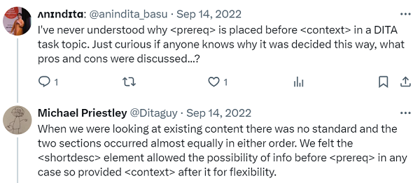

---
myst:
  html_meta:
    "canonical": "https://writing-technically.readthedocs.io/en/latest/courses-dita-authoring-topics.html"
    "description": "A lesson that shows how to create topics in DITA and contains some exercises"
    "title": "Learn to create topics in DITA"
    "twitter:description": "A lesson that shows how to create topics in DITA and contains some exercises"
    "twitter:title": "Learn to create topics in DITA"
    "twitter:image": "https://writing-technically.readthedocs.io/en/latest/_static/wordcloud.jpg"
    "twitter:card": "summary_large_image"
    "twitter:creator": "@anindita_basu"
    "twitter:site": "@anindita_basu"
    "og:locale": "en_US"
    "og:site_name": "Writing technically"
    "og:url": "https://writing-technically.readthedocs.io/en/latest/courses-dita-authoring-topics.html"
    "og:type": "article"
    "og:title": "Learn to create topics in DITA"
    "og:description": "A lesson that shows how to create topics in DITA and contains some exercises"
    "og:image": "https://writing-technically.readthedocs.io/en/latest/_static/wordcloud.jpg"
    "author": "Anindita Basu"
---

# DITA lesson 4: Topics

<hr/>
<p style="font-weight:bold;font-size:75%;color:orange">14 April 2024</p>

In a [previous lesson](courses-dita-authoring-infotype.md), you learnt about arranging information into discrete buckets called topic types. In [another lesson](courses-dita-authoring-tags.md), you learnt about tags. In this lesson, you'll use these learnings to create DITA topics.

After collecting your information and broadly separating them into concepts, tasks, and references, you'll now put them in DITA.

To do so more easily, download and install a DITA-aware authoring tool called [XMLMind](https://www.xmlmind.com/xmleditor/download.shtml). The Personal Edition is free to use, with the caveat that XMLMind will randomly add an alphabet or two to some words here and there. This should be fine because the focus of these lessons isn't on writing _per se_ but on becoming familiar with writing in DITA.

```{admonition} Focus is on DITA, not the tool

   Remember that there are several DITA writing tools available and, in an org, the choice of the tool is made by people way above our paygrade. There are standalone DITA writing tools such as XMLMind Editor, oXygen Editor, or FrameMaker, and then there are DITA CMS (content management system) writing tools such as Ixiasoft, Tridion, Vasont, or Paligo.
   
   For these lessons, XMLMind Editor is used because:
   
   -  It's free to use.
   -  It generates HTML, looking at which you'll get a feel of what your "book" will look like on a documentation portal.
   
   You can choose to use the free trial version of oXygen Editor as well, but be aware that the trial period gets over in a month, and you cannot start a fresh trial on the same computer.
   
   Retain your focus on the writing, not the tool.

```

## Concept topics

```
  concept
  ├── title
  ├── shortdesc
  ├── conbody
      ├── block tags (paragraphs, lists, codes, tables, images, ...)
      ├── section
          ├── title
          ├── block tags (paragraphs, lists, codes, tables, images, ...)
      ├── related-links
          ├── link
```

Here's an [example concept topic](https://www.ibm.com/docs/en/cics-pa/5.4.0?topic=started-what-is-cics-performance-analyzer-zos). Which tags were used to mark up the content, can you tell?

## Task topics

```
  task
  ├── title
  ├── shortdesc
  ├── taskbody
      ├── prereq
          ├── block tags (paragraphs, lists, codes, tables, images, ...)
      ├── context
          ├── block tags (paragraphs, lists, codes, tables, images, ...)
      ├── steps
          ├── step
              ├── substeps
                  ├── substep
                  ├── stepxmp
                  ├── stepresult
              ├── stepxmp
              ├── stepresult
      ├── result
          ├── block tags (paragraphs, lists, codes, tables, images, ...)
      ├── postreq
          ├── block tags (paragraphs, lists, codes, tables, images, ...)
      ├── related-links
          ├── link
```

If you're wondering why `<context>` should be placed after `<prereq>`, here's an explanation from someone who was on the team that created DITA.



Here's an [example task topic](https://www.ibm.com/docs/en/engineering-lifecycle-management-suite/lifecycle-management/7.0.3?topic=data-starting-websphere-liberty-server). Guess the tags?

## Reference topics

```
  reference
  ├── title
  ├── shortdesc
  ├── refbody
      ├── block tags (paragraphs, lists, codes, tables, images, ...)
      ├── section
          ├── title
          ├── block tags (paragraphs, lists, codes, tables, images, ...)
      ├── example
          ├── title
          ├── block tags (paragraphs, lists, codes, tables, images, ...)
      ├── related-links
          ├── link
```

Here's an [example reference topic](https://docs.rocketsoftware.com/bundle/mainstar_cr_ug/page/reference/ckm_uref_altergdg.html).

##  Exercise

Use XMLMind Editor to do the following assignments. Feel free to play around with tags.

-  Create a concept topic (**File** > **New** > **DITA** > **Concept**) and put the text of the following file into this topic: [messages_messengers.txt](_static/messages_messengers.txt). You'll also need this file: [messages_messengers.jpeg](_static/messages_messengers.jpeg).
-  Create a task topic  (**File** > **New** > **DITA** > **Task (Strict)**) and put the text of the following file into this topic: [sending_bottled_messages.txt](_static/sending_bottled_messages.txt).
-  Create a task topic  (**File** > **New** > **DITA** > **Reference**) and put the text of the following file into this topic: [tides.txt](_static/tides.txt).
-  Refer back to the [Information typing](courses-dita-authoring-infotype.md) lesson. Take the content you created for the exercise in that topic, and put it into topic types and tags.

## What next?

In the [next lesson](courses-dita-authoring-maps.md), you'll learn about how to assemble discrete topics into a book.

<hr/>

```{include} courses-dita-authoring-toc.md
```
   
<hr/>
