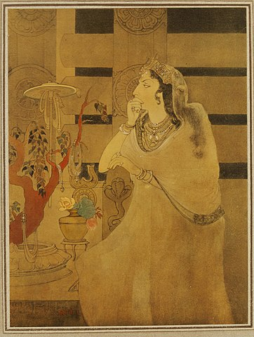

.. meta::
   :canonical: https://writing-technically.readthedocs.io/en/latest/index-thoughts.html
   :description: A sharing of notes and blog posts that will (hopefully) spark ruminations, discussions, and construction-destructions in technical writing
   :title: Thoughts on technical writing
   :twitter\:description: A sharing of notes and blog posts that will (hopefully) spark ruminations, discussions, and construction-destructions in technical writing
   :twitter\:title: Thoughts on technical writing
   :twitter\:image: https://writing-technically.readthedocs.io/en/latest/_static/wordcloud.jpg
   :twitter\:card: summary_large_image
   :twitter\:creator: @anindita_basu
   :twitter\:site: @anindita_basu
   :og\:locale: en_US
   :og\:site_name: Writing technically
   :og\:url: https://writing-technically.readthedocs.io/en/latest/index-thoughts.html
   :og\:type: article
   :og\:title: Thoughts on technical writing
   :og\:description: A sharing of notes and blog posts that will (hopefully) spark ruminations, discussions, and construction-destructions in technical writing
   :og\:image: https://writing-technically.readthedocs.io/en/latest/_static/wordcloud.jpg
   :author: Anindita Basu

Thoughts
==========

.. raw:: html

   

A sharing of notes that will (hopefully) spark ruminations, discussions, and construction-destructions.

.. raw:: html

   

.. epigraph::

   Be not afeard; the isle is full of noises,

   Sounds and sweet airs, that give delight and hurt not.

   Sometimes a thousand twangling instruments

   Will hum about mine ears.

   -- William Shakespeare, *The Tempest*

.. raw:: html

   

.. toctree::
    :maxdepth: 1

    thoughts-dita-without-dita.md
    thoughts-dita-tipping-point.md
    thoughts-content-similarity.md

.. raw:: html

   

