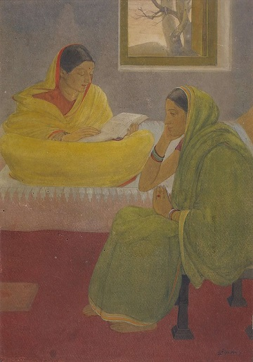

.. meta::
   :canonical: https://writing-technically.readthedocs.io/en/latest/index-words.html
   :description: Etymology of some words and phrases used in technical writing, with examples and notes
   :title: The technical writing lexicon
   :twitter\:description: Etymology of some words and phrases used in technical writing, with examples and notes
   :twitter\:title: The technical writing lexicon
   :twitter\:image: https://writing-technically.readthedocs.io/en/latest/_static/wordcloud.jpg
   :twitter\:card: summary_large_image
   :twitter\:creator: @anindita_basu
   :twitter\:site: @anindita_basu
   :og\:locale: en_US
   :og\:site_name: Writing technically
   :og\:url: https://writing-technically.readthedocs.io/en/latest/index-words.html
   :og\:type: article
   :og\:title: The technical writing lexicon
   :og\:description: Etymology of some words and phrases used in technical writing, with examples and notes
   :og\:image: https://writing-technically.readthedocs.io/en/latest/_static/wordcloud.jpg
   :author: Anindita Basu

Words
=======

.. raw:: html

   

A lexicon of words and phrases.

.. raw:: html

   

.. epigraph::

   'Twas brillig, and the slithy toves

   Did gyre and gimble in the wabe:

   All mimsy were the borogoves,

   And the mome raths outgrabe.

   -- Lewis Carrol, *Jabberwocky*

.. raw:: html

   

.. toctree::
    :maxdepth: 1

    words-content.md
    words-ephemeral.md
    words-manager.md
    words-navigate.md
    words-swagger.md
    words-write.md

.. raw:: html

   

