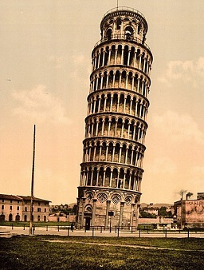

---
myst:
  html_meta:
    "canonical": "https://writing-technically.readthedocs.io/en/latest/words-italics.html"
    "description": "Definition and origin of the word Italics, and some notes and examples"
    "title": "Etymology of Italics"
    "twitter:description": "Definition and origin of the word Italics, and some notes and examples"
    "twitter:title": "Etymology of Italics"
    "twitter:image": "https://writing-technically.readthedocs.io/en/latest/_static/wordcloud.jpg"
    "twitter:card": "summary_large_image"
    "twitter:creator": "@anindita_basu"
    "twitter:site": "@anindita_basu"
    "og:locale": "en_US"
    "og:site_name": "Writing technically"
    "og:url": "https://writing-technically.readthedocs.io/en/latest/words-italics.html"
    "og:type": "article"
    "og:title": "Etymology of Italics"
    "og:description": "Definition and origin of the word Italics, and some notes and examples"
    "og:image": "https://writing-technically.readthedocs.io/en/latest/_static/wordcloud.jpg"
    "author": "Anindita Basu"
---

# Italics

<hr/>
<p style="font-weight:bold;font-size:75%;color:orange">20 April 2024</p>

```{admonition} italics

   (_adjective_) Of or being a style of printing type patterned on a Renaissance script with the letters slanting to the right: _This sentence is printed in italic type._ [^ahd]
```

[^ahd]: From the [American Heritage Dictionary](https://ahdictionary.com/word/search.html?q=Italics).

## Origin

16th century, from the Latin word _Italicus_, from _Italia_, Italy. [^mw]

[^mw]: From the [Merriam-Webster Dictionary](https://www.merriam-webster.com/dictionary/italics)

## Example



## Notes

There once lived in Italy a man called Aldus Manutius, who started a printing press called Aldine Press. This was the time of the Renaissance. The Aldine Press printed several Greek and Latin works, for which Manutius used typefaces that resembled human handwriting. Thus was born the _italic_ typeface, which was used for the first time in 1501 in the Aldine Press publication of Virgil. The print run was a blockbuster. Usual print runs were for 200 - 500 copies. This one, with the _italic_ typeface, ran to 1000 copies.

Manutius had a copyright for the typeface within Venice (from where the Aldine Press operated). However, it became very popular and others used it outside Venice, where Manutius couldn't enforce his copyright. The _italic_ typeface spread outside of Italy, and lives to this day.

<hr/>
