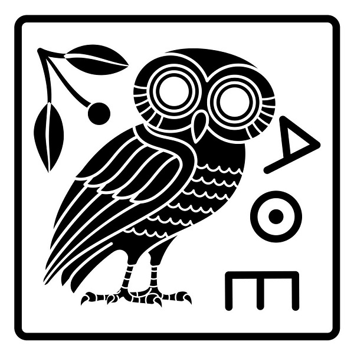

# Write

<hr/>
<p style="font-weight:bold;font-size:75%;color:orange">24 July 2022</p>

```{admonition} write

   (_verb_) Mark (letters, words, or other symbols) on a surface, typically paper, with a pen, pencil, or similar implement. [^oxford]
```

[^oxford]: From the [Oxford English Dictionary](https://www.lexico.com/).


## Origin

Old English _wrītan_, which means 'to score, or form (letters) by carving, write'.

## Example

<iframe width="560" height="315" src="https://www.youtube.com/embed/0xBJdhexwug?start=685" title="YouTube video player" frameborder="0" allow="accelerometer; autoplay; clipboard-write; encrypted-media; gyroscope; picture-in-picture" allowfullscreen></iframe>

## Notes

The word comes from Old English _writan_, which is a word of Germanic origin, related to the German word _reissen_, meaning 'sketch' or 'drag'.

It is, thus, evident that many many years ago, writing included sketching and drawing — just like technical writing does today.

